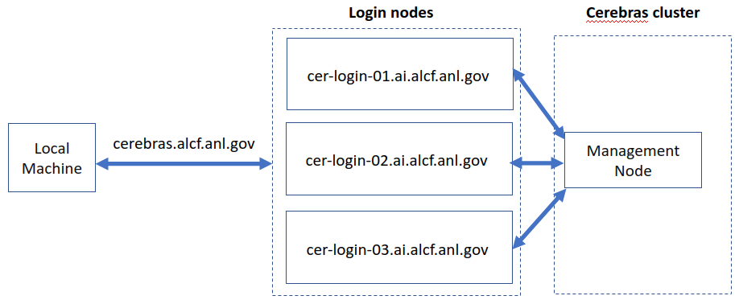

# Cerebras 

## Connection to a CS-2 node

Connection to one of the CS-2 cluster login nodes requires an MFA passcode for authentication - either an 8-digit passcode generated by an app on your mobile device (e.g. MobilePASS+) or a CRYPTOCard-generated passcode prefixed by a 4-digit pin. This is the same passcode used to authenticate into other ALCF systems, such as Theta and Cooley.



To connect to a CS-2 login, ssh to login nodes:
```bash
ssh ALCFUserID@cerebras.ai.alcf.anl.gov
```

## Create Virtual Environment 

### PyTorch virtual environment

```bash
#Make your home directory navigable
chmod a+xr ~/
mkdir ~/R_1.9.2
chmod a+x ~/R_1.9.2/
cd ~/R_1.9.2
# Note: "deactivate" does not actually work in scripts.
deactivate
rm -r venv_pt
/software/cerebras/python3.8/bin/python3.8 -m venv venv_pt
source venv_pt/bin/activate
pip3 install /opt/cerebras/wheels/cerebras_pytorch-1.9.2+92b4fad15b-cp38-cp38-linux_x86_64.whl --find-links=/opt/cerebras/wheels
pip install numpy==1.23.4
pip install datasets transformers
```
<!---
### Tensorflow Virtual environment

```bash
chmod a+xr ~/
mkdir ~/R_1.9.2
chmod a+x ~/R_1.9.2/
cd ~/R_1.9.2
# Note: "deactivate" does not actually work in scripts.
deactivate
rm -r venv_tf
/software/cerebras/python3.8/bin/python3.8 -m venv venv_tf
source venv_tf/bin/activate
#pip install tensorflow_datasets
#pip install spacy
pip3 install pip3 install /opt/cerebras/wheels/cerebras_tensorflow-1.9.2+92b4fad15b-cp38-cp38-linux_x86_64.whl --find-links=/opt/cerebras/wheels/
pip install numpy==1.23.4
```
--->
## Clone Cerebras modelzoo

We use example from [Cerebras Modelzoo repository](https://github.com/Cerebras/modelzoo) for this hands-on. 
Clone the modezoo repository.<br>
Note: For virtual environent R_1.9.2, the modelzoo is unchanged from R_1.9.1. 
```bash
mkdir ~/R_1.9.2
cd ~/R_1.9.2
git clone https://github.com/Cerebras/modelzoo.git
cd modelzoo
git tag
git checkout Release_1.9.1
```

## Job Queuing and Submission

The CS-2 cluster has its own Kubernetes-based system for job submission and queuing. Jobs are started automatically through the Python scripts. 

Use Cerebras cluster command line tool to get addional information about the jobs.

* Jobs that have not yet completed can be listed as
    `(venv_pt) $ csctl get jobs`
* Jobs can be canceled as shown:
    `(venv_tf) $ csctl cancel job wsjob-eyjapwgnycahq9tus4w7id`

See `csctl -h` for more options.

## Run Examples

Refer to respective instrcutions below 
* [FC-MNIST](./fc-mnist.md)
* [BERT-Large](./bert-large.md)

# Useful Resources 

* [ALCF Cerebras Documentation](https://docs.alcf.anl.gov/ai-testbed/cerebras/system-overview/)
* [Cerebras Documntation](https://docs.cerebras.net/en/latest/wsc/index.html)
* [Cerebras Modelzoo Repo](https://github.com/Cerebras/modelzoo/tree/main/modelzoo)
* Datasets Path: `/software/cerebras/dataset`
